# Pandapute — Dev Journal

## 2026-07-07 — Session 1: Project Kickoff (~3 hours)

The project started out with me seeing a fellow maker friend using a cardputer, and i thought it was cool - but then i tried using it myself,
and the tiny keyboard drove me crazy and the screen was so small i needed glasses - not ideal. Since i wanted to build a Cyberdeck anyway but was laxking experience,
i thought i would try and make one from scratch to get some experience with this stuff, and i can get a grant from outpost.

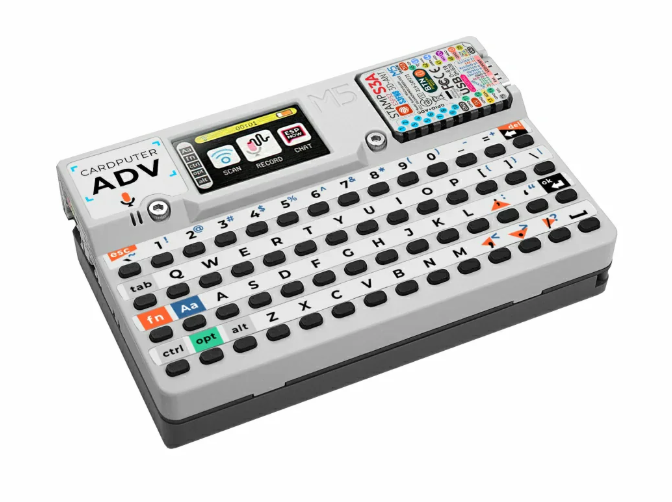

Started out thinking "how hard can it be to build a Cardputer clone?" lol.

Went back and forth on where to buy stuff. Reichelt, Mouser, Amazon, Keycapsss, AliExpress — none of them have everything. Finally realized I should just design the PCB first and let JLCPCB/PCBWay assemble whatever they can, then I only buy the leftovers myself (switches, battery, display, speaker, keyboard stuff).

The plan: **everything on a custom PCB, bare components, no dev boards.** Took a while to get that through my head — kept getting suggested dev boards with displays attached. No. From scratch.

Spent way too long on AliExpress browsing parts. Added ESP32-S3-WROOM-1-N16R8 for €8.59, AMS1117 for pennies, a battery — then realized shipping was gonna kill me if I buy everything separate. So fine, JLCPCB will source the ICs, I'll just get the mechanical stuff myself.

### What I want this thing to have

- Bigger display than the Cardputer (2.8" instead of 1.14")
- Real mechanical Kailh Choc switches, not the membrane one
- Same audio, IR, IMU, microSD — but better
- USB/BT keyboard mode (that's just firmware, ESP32-S3 handles it)
- Grove port for expansion + a bunch of GPIO headers
- RGB LED because why not
- 2000mAh battery (Cardputer has 1750)

## 2026-07-07 — Session 3: Wiring the Power Section (~4 hours)

I am not familiar with any of this which is why it took long. This session was all about wiring the power section in KiCad — correcting mistakes from the last session, adding missing components, and finally getting a complete power tree on the schematic.

What I wired:

- IP5306: VIN→VUSB, SW→L1→BAT, VOUT→+5V, KEY→SW→GND, POWERPAD→GND, LED1→1k→LED
- AP2112K-3.3: VIN→+5V, EN→+5V, VOUT→+3.3V, GND→GND + decoupling caps
- ESP32-S3: 3V3→+3.3V, GND→GND, BOOT→SW→GND, EN→10k to +3.3V + 1µF to GND + SW→GND
- USB_D-/D+ labels connected to GPIO19/20
- Power switch on battery line
- Battery ADC (100k/100k divider + 0.1µF on GPIO1)
- Power LED (1k + LED on +3.3V)
- All C1–C5 caps placed correctly (10µF on VIN, 22µF on BAT/VOUT, 10µF on regulator I/O)

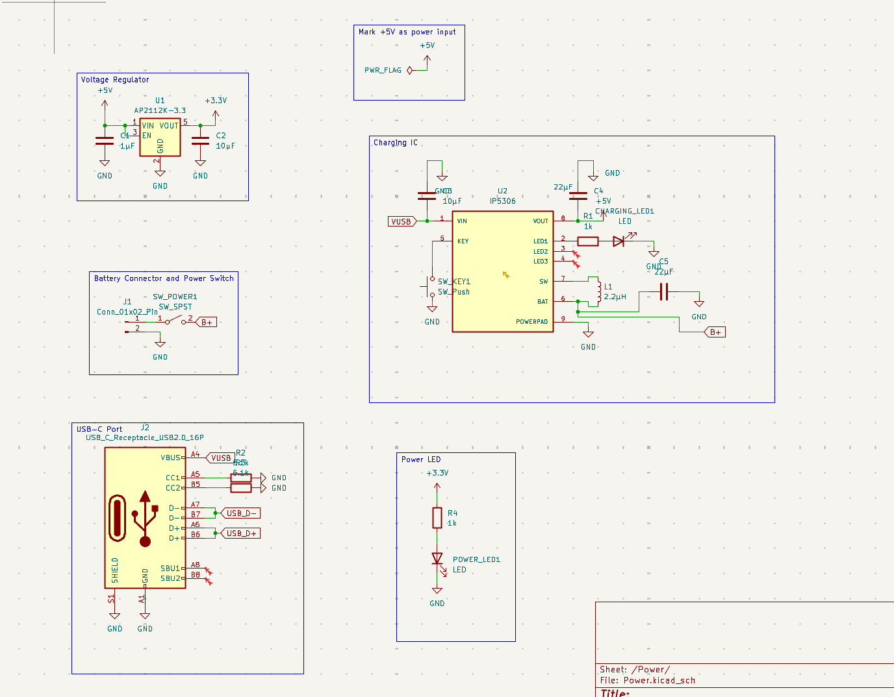

It took literal ages to wire this with soooo much troubleshooting help from gemini, deepseek, opencode and literally everything
Mostly it was the capacitors and resistors and looking at a trillion different stupid datasheets that never have accurate info or a simple
example circuit that pissed me off. also i just realized i would have to wire a differential pair _and_ power lines on the PCB, which _is_ good practice,
but also **exactly** what i was trying to avoid.
anyway, peace out, i think ima work on audio next

## 2026-08-07 - Session 4: Wiring rest of schematic ! (~ 8 hours)

So today i wired the rest of the schematic !

I wired the entire audio sheet - including the mic, speakers, and audio jack : This includes the signal amplifier, the encoder, one stereo speaker, microphone, and also a headphone 3mm audio jack that unfortunately still plays stereo sound.
If you don't no what the difference between stereo and audio sound is, stereo is : stereo is basically built for one type of audio (a single speaker), while stereo is designed for two sides, with both sides playing a bit differently

after that i started wiring the display (which i decided will also have touch) AND SD card slot - because they actually can come together as one module. cause i could'nt find a symbol for this _special_ component, i just used a Pin connector each for both sides.

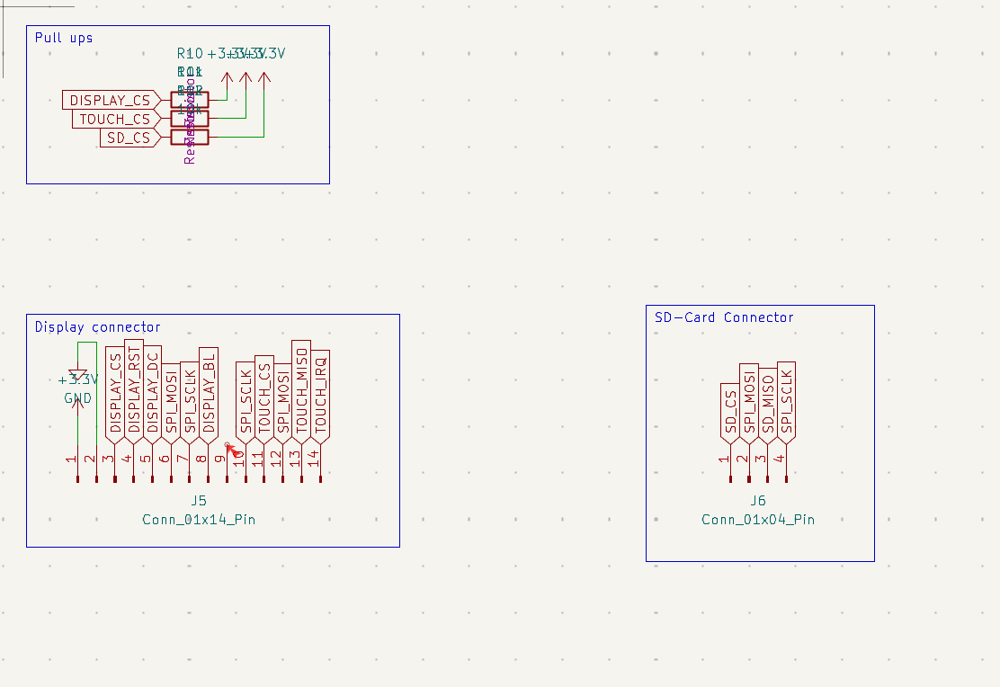

Next was the easiest, and probably most satisfying part : The keyboard matrix
The main goal with the Keyboard Matrix was to make it

- as compact and small as possible
- good looking
- low profile
- not too hard to type on
- use a small amount of GPIO pins

in the end, i was able to do all this by using this switch matrix scanner chip called the TCA8418RTWR that takes over all the keyboard matrix scanning :

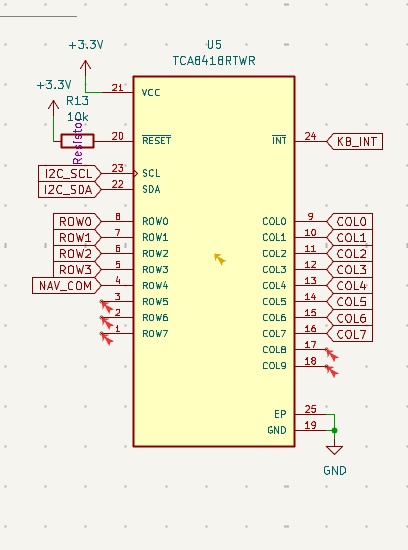

In the End i decided to use a 32-Key layout with 4 rows and 8 coloumns :

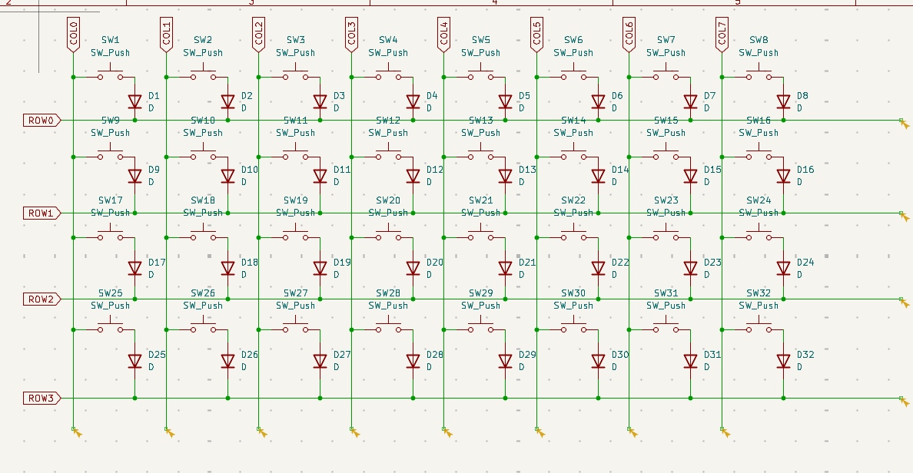

Then came the last (and **most fun**) part - the Peripherals

I decided i wanted some fun stuff like:

- a 5-way nav switch (that is incorporated in the switch matrix to save GPIO pins)

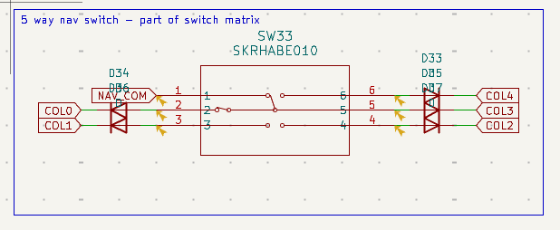

- a tilt and movement sensor (accelerometer & barometer 2 in 1)

- headers so i can connect other components - i exposed 5 GPIO pins, I2C/Grove for OLEDs and sensors and stuff, and basic Power (3V, 5V, GND, direct battery)

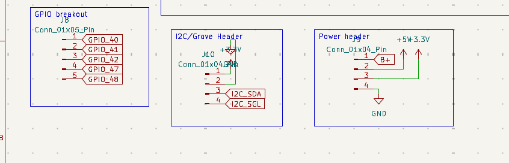

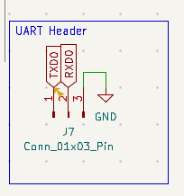

I had wanted to add a rotary encoder, but my GPIO pins ended up occupied and i did not wanna get rid of the GPIO header just for this - also i feel like i uee keyboard shortcuts for everything anyway
next up is footprint assignment and then pcb design, but im rather worried about the footprint for my display + sd module
the problem is, this module has both touch, display, and an sd card, and i cannot find a footprint for that - i could find some that have only diplay and touch, but no SD, or display and SD, but touch unused -
because of this issue, i will just use 2 connectors that are just approx. where the connectors on the module are, and either

1. submit the design files with the approximate measurement, then order the component, buy it, measure where the connector should go, and then adjust my PCB design
   or
2. plug in only one side and use a cable for the other side.

## 2026-09-07 - Session 5 : Footprint assignment and PCB start !

Yeah so i imported, adjusted and assigned every component, and then added everything to the PCB
I then exported everything as a PDF and gave it to an LLM so it could look over it and point out any errors.
I had some minor errors, like some Pads not connected to GND when theyt should have been and a wrong capacitor value, but otherwise
im pretty proud of myself.

Next is to arrange the components on the PCB - also it got recommended to me by the AI
to use a 4 layer PCB, as that lets me dedicate a layer each to GND and POWER - so i have less traces, and no spider nest - cause otherwise EVERY
GND or +3V/+5V connection would need a trace.

## 2026-10-07 - Session 6 : PCB placement start !

I started arranging the stuff on the PCB, but today i had a lot to do other than techie stuff,
and went out with friends, then got my wallet stolen D: . Anyway after all that stress i wasn't really feeling like
working on the project, but i didn't wanna lose my streak so i did a little bit

i powered through arranging the key matrix properly, with all the diodes correctly aligned with the correct keys, and this was probably the most satisfying
part of the project - i think it looks **neat**

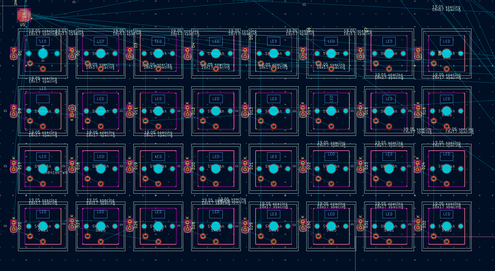

then i started arranging like the Headers and stuff

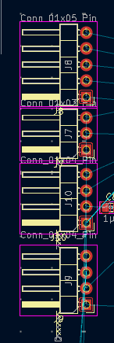

after that came the Audio section - and look at how tiny those chips are - im getting anxiety let alone looking at them, and am trying not to think about tryna
wire and then **solder** those tiny ass pins - look at that chip in comparison to a capacitor:

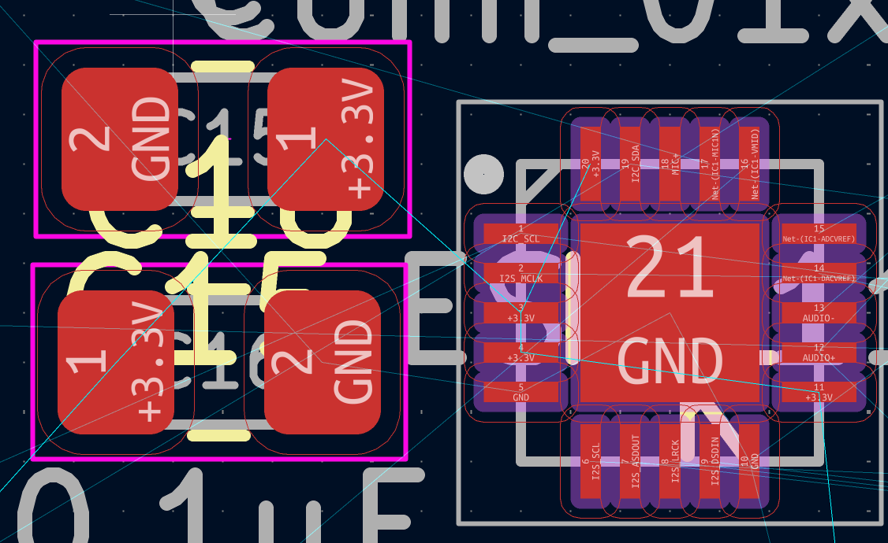

also i did the display part and used a 3D model i found of the component for measurements - i think its accurate enough

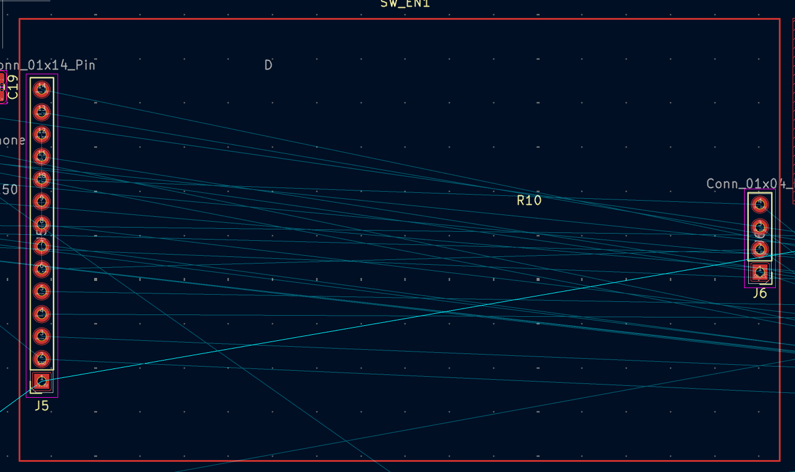

i also arranged a lil bit on the ESP and the like boot/power/key switches :

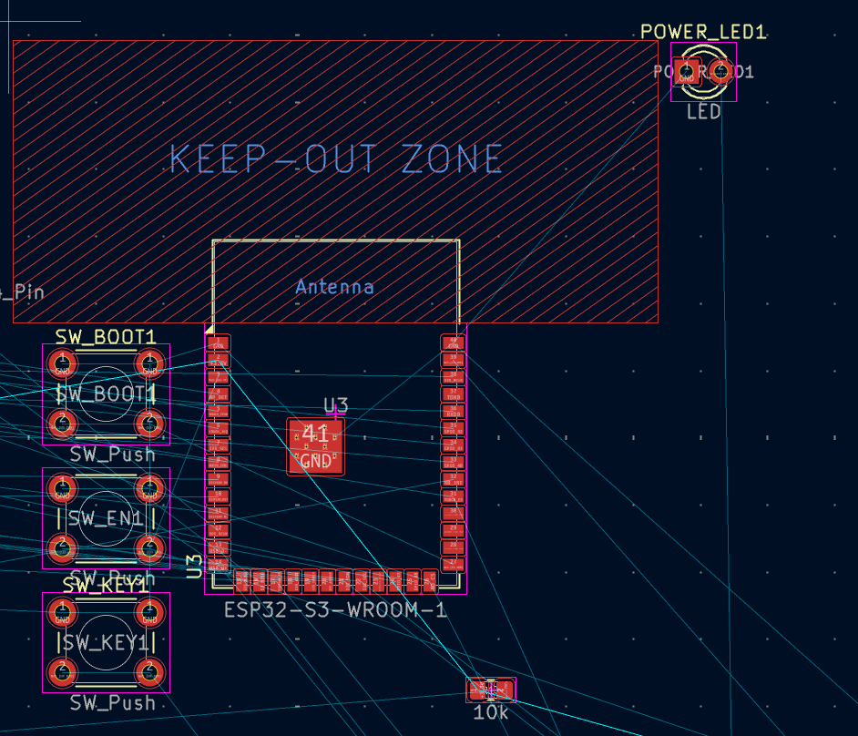

the rest i will do tomorrow - im really putting off placing the capacitors and resistors cause thats a pain in the ass -
id have to double check where every one goes cause the airwires go crazy cause of the Net labels i used and cause most of them are
decoupling capacitors, i have to check the schematic on how/where to place them, and im not looking forward to it.

Anyway thats all for today, see ya tmrw !

## 2026-10-07 - 2026-13-07: (~ 3 hours)

So i havent had time this weekend to really sit down and have a long KiCad session, so i did a few small sessions over the weekend :

I routed basically all the Power nets (+5V and +3.3V) and also the VBUS line from the USB-C receptacle to the IP5306. Next up i think i
will route the data lines from the USB-C receptacle, since those are high speed - there the choice is, do i route them as a differential pair or no ?

I looked online , and it seems i can _technically_ just route normal wires and it would be simpler ... that would be **boring**,
i wouldn't learn anything, and its not recommended - so im going the hard route, and routing a differential pair !

This will be ... **interesting** to say the least.

## 2026-15-07: Wiring done ! (~ 6 hours)

Soo ... IM DONE BABYYYYYY

whooo
that was **something**
Anyway, i finished routing everything on the board, starting with most important to least important, and im finally done !
I used an _ungodly_ amount of vias, and cheated a bit sometimes by using the GND and PWR plan for some wires where there was just NO space.
I ran **DRC** and it started bitching about pin spacing on some of the fooprints and something bout the solder mask min width, but i was able to adjust some things in the board settings.
after that i still had 8 errors, but none of those were problematic actual errors, just KiCad complaining, so i was able to exclude those,
and now both me **and** KiCad are happy as a clam

anyway, brace yourself for the absolutely horrifying sight of my PCB :

also, while your already in shock, why not throw another one in - this PCB is **DAMN** expensive - apparently because this is a 4 layer BIG ASS (191 x 158 mm) PCB, it will cost a huge amount of money -
i wanted a quick price quote so i nicely zipped up my gerbers and uploaded em onto PCBway and its a whopping **140 dollars** in total - so yeah im givin up hope on this ever being S tier, so now fingers crossed that i get X tier approved, cause otherwise i am **_cooked_**

YEAHHHHH, so next part is either **case** or **firmware**

Programming this thing is gonna be like programming an OS for the first Iron Man suit (_tony stark built this with a box of scraps in a cave !_),
cause i have absolutely no idea how half those devices work, or even how to code hardware at all, so ill probably leave this part to my trusty partner
opencode, we'll see how it goes

Ok, so next up is the case

I have thought about this quite a bit, and this is my thought process :

i have 3d printed things before, and i really don't like the texture of the things, or just the _feel_ -
if this device is something ima use often, i want it to feel **_good_** in my hands, and normal 3d print filament doesn't do that.
So i looked at my options - one option is to use CNC and make a case out of ... **what ?** ... **METAL ?** or other material, and i would do the same 3d modeling asd always, and have done before,
like for my macropad and split keyboard. This is pretty simple, just make a bottom and a top with holes for everything, then add screw holes to connect them while PCB is inside and tadaa, you have a case.
Problem is, thats _boring_. Instead i had one more idea - **woodworking**. My local makespace has a (german incoming) **Hobelhoehle** - basically a wood workshop on steroids, and i've never gotten a chance to use it.
So im thinking of making a wood case from scratch with a nice finish - you might be thinking it will feel rough, but you'd be surprised how smooth and premium feeling **wood** can get.

So i'll think about it a bit, but this is the option im leaning towards, because its :

- a good use of the wood workshop
- a learning experience
- i would say better feeling
- more accurate - cause i can assemble the PCB myself, then measure everything and make sure it fits, instead of potentially spending hours on a 3d print that might not fit cause of bad blueprints or measurements on the component
- _FUNNNNN_
- **FUNN**

so yeah, ill think about it.

Also, i feel like im in an Andy Weir book with all the logging and journaling. i feel like the dude from the martian, Mark Watney. Exceot i wont die if i mess shit up. Eh.
