# Pandapute - a mini computer built from scratch

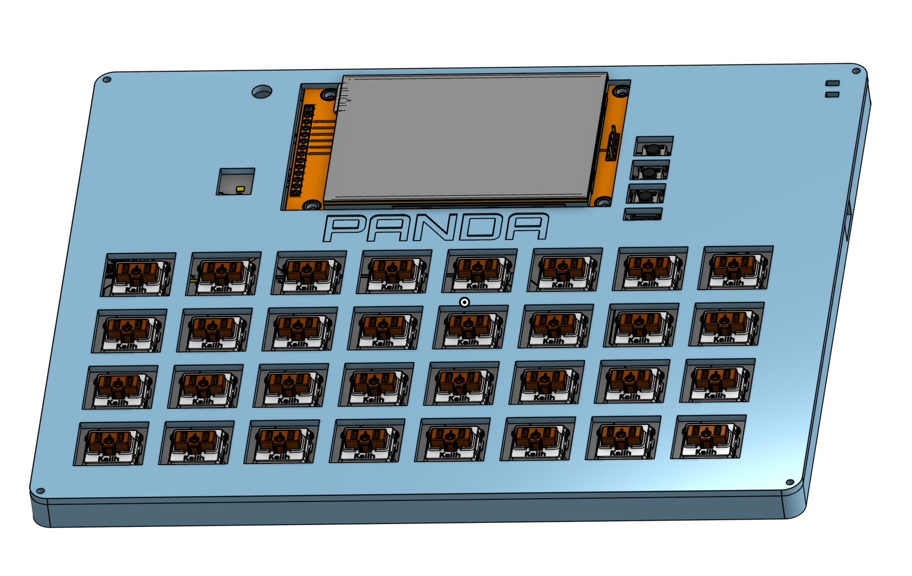

Before you keep reading and find out more about my kickass project, first I want to give credit and a massive thanks to @zsharpminor, or Udo - He's my first friend on Hack Club, a reviewer, and all-around great guy who helped me with this project along every step of the way.
This project would not have been possible without him, so <3 to him :D

## The Inspiration

So, one day I was working on my Split Keyboard project at my makespace, and I saw a friend of mine using a cardputer adv (which is a small, portable esp-based computer - see pic), and was curious.
I asked him what it was, and he showed me, and I gotta say, I was skeptical at first, but then I was blown away - I just had one complaint when I saw the thing :
the keyboard. You see, the original cardputer uses this tiny ass 56-key keyboard, which is 1) too many keys in my opinion, and 2) extremely hard to type on.

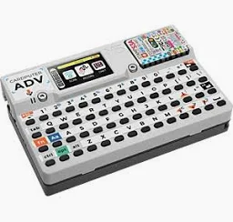

So, I decided to make my own, and get funding from Outpost.

## The Features

So, the Pandapute features every single feature the Cardputer has + more !

It has :

- The best ESP32 chip that has wifi and bluetooth capabilities (ESP32-S3-WROOM-1-N16R8)
- an actual **extremely** low profile, compact, built in mechanical 32-key keyboard
- an Audio Jack
- A LiPo battery that will last ages
- a built in speaker
- a microphone
- exposed I2C, GPIO, Power, etc. Pins so you can connect external modules or breakout boards, like a secondary display
- A USB-C port for **both** flashing **and** charging
- a tilt sensor (to do cool stuff)
- a 2.8" display (around twice as big as the cardputer)

## The Build

The Cardputer is built from scratch by me, Panda

It features an entirely custom

### Schematic

#### Power

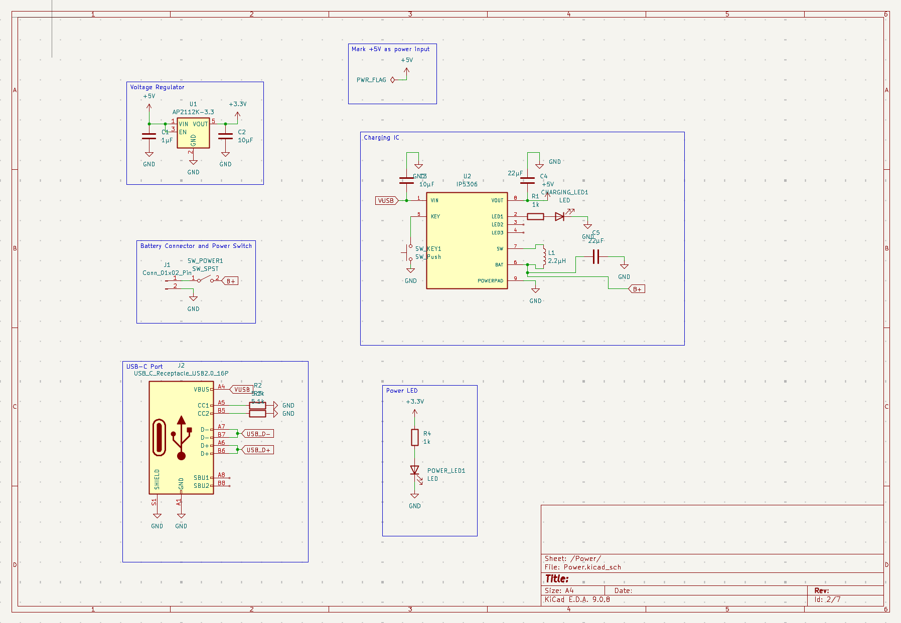

#### ESP


#### Audio

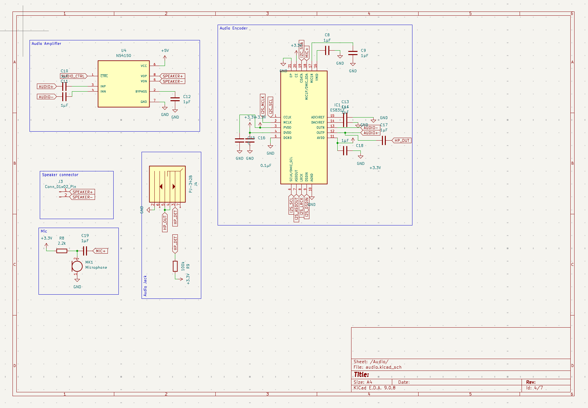

#### Display

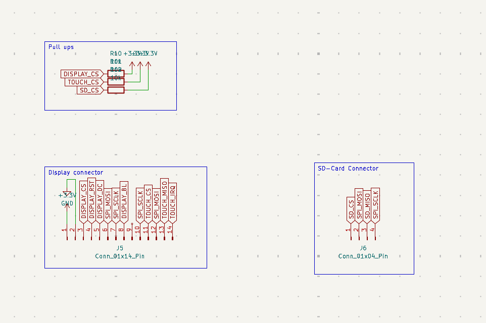

#### Keyboard

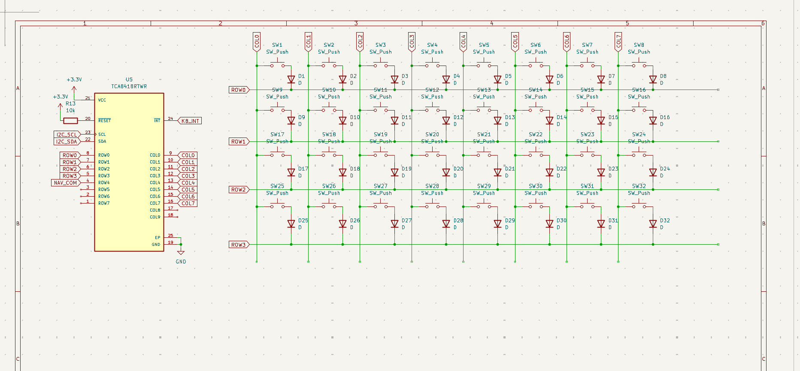

#### Peripherals

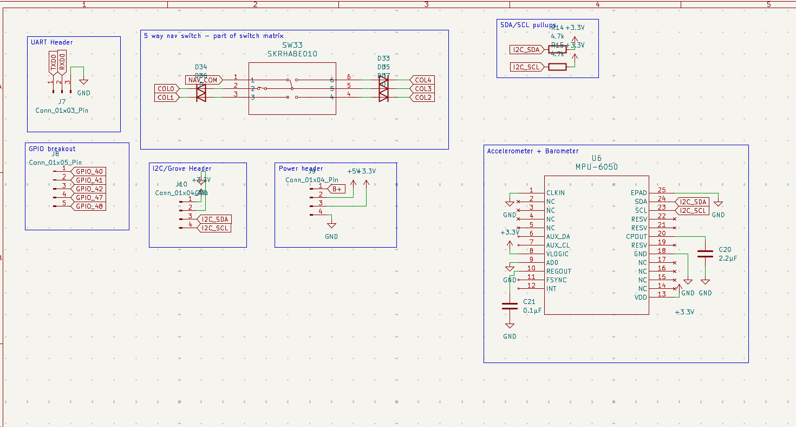

and

### PCB

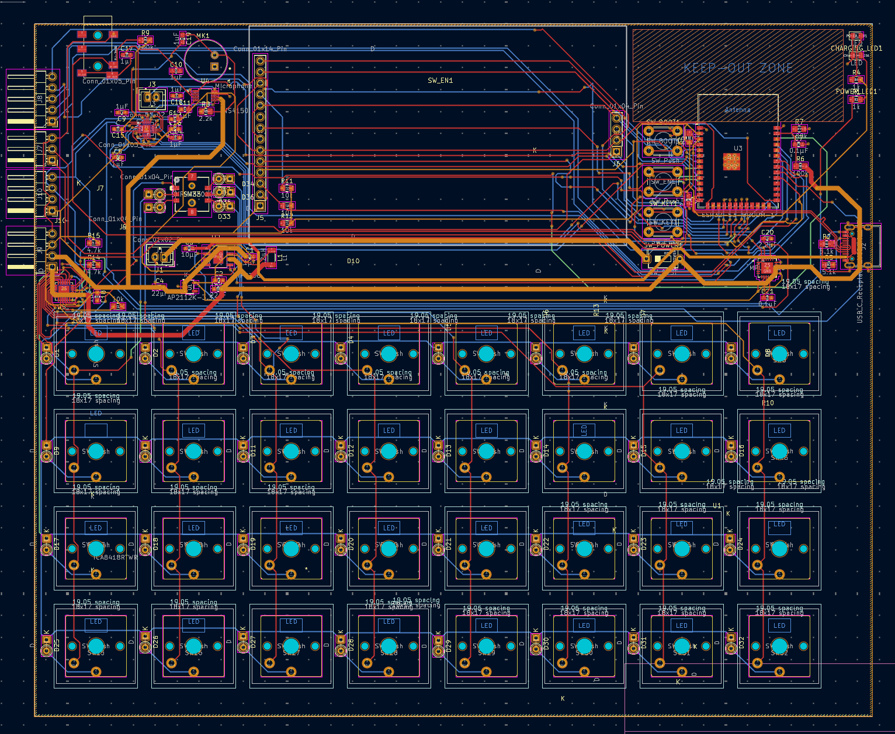

to visualize how this will look in real life, here are a few pics ! I only added the important components that you'll actually see, not the encoder chips and stuff :

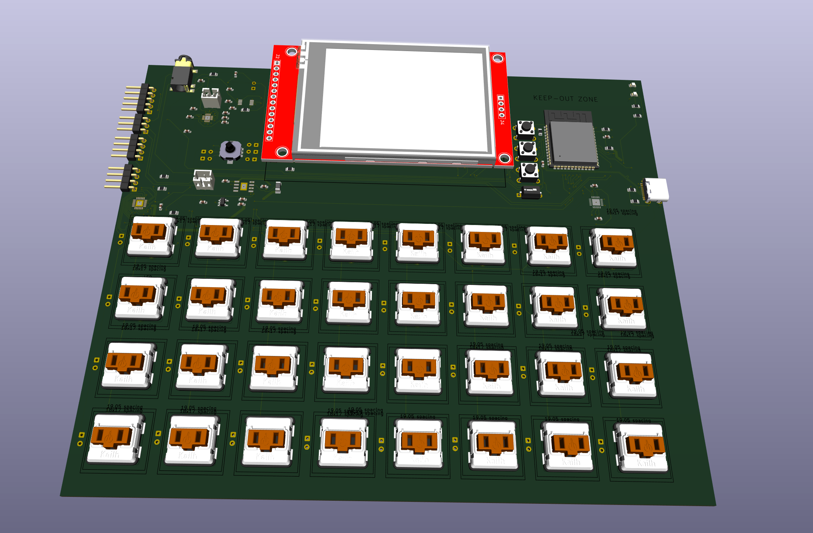

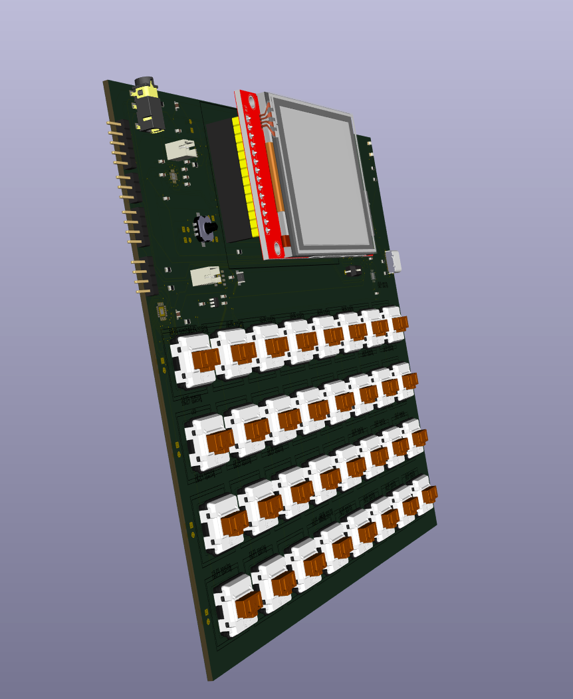

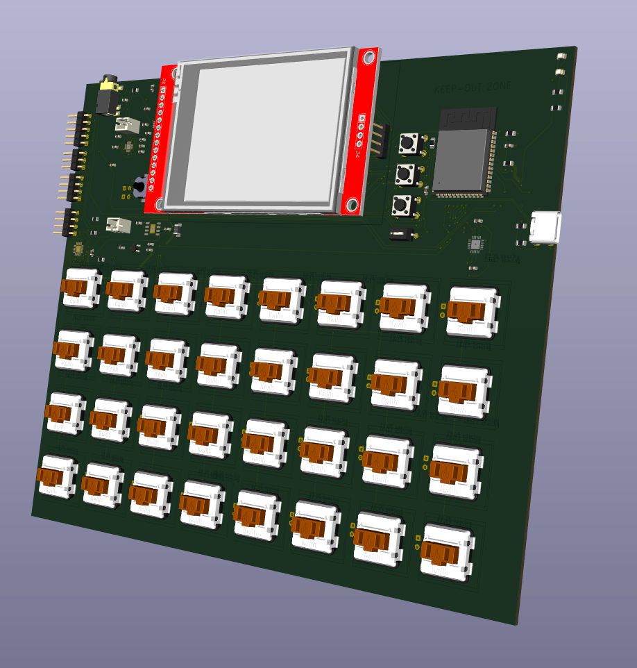

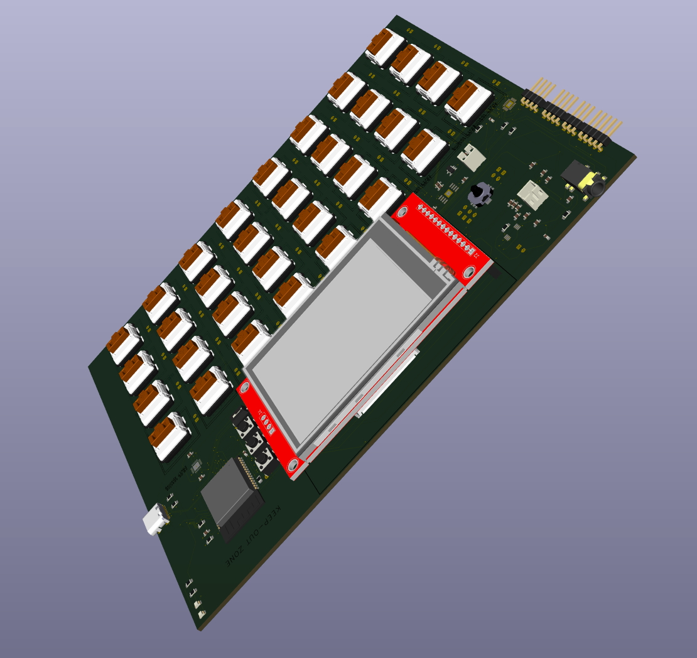

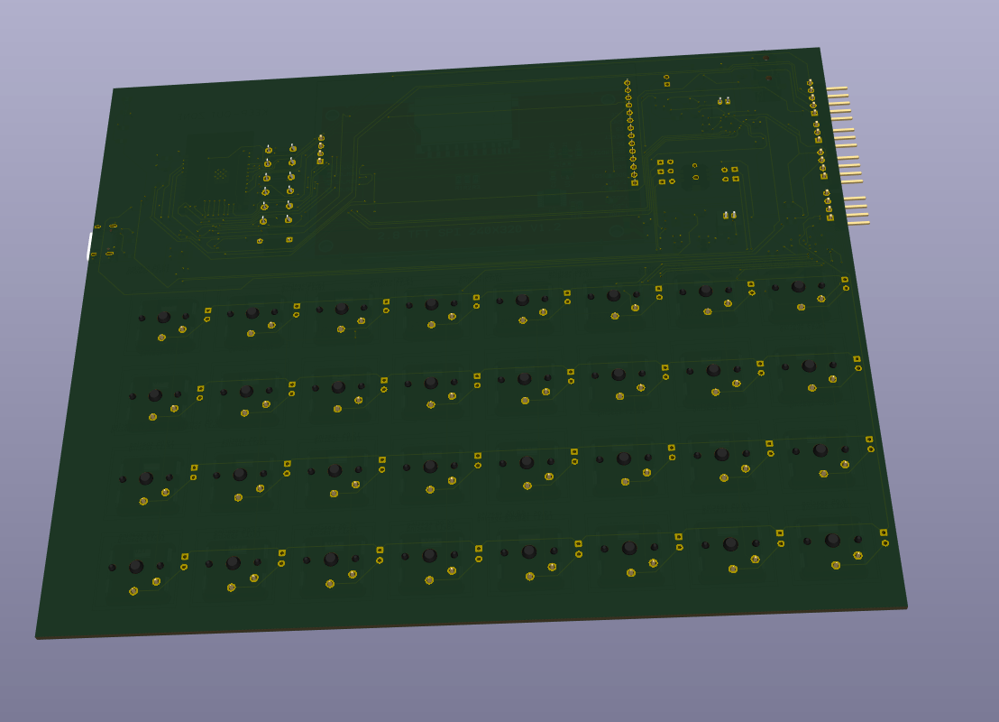

Now you're probably wondering, will you just carry a PCB around ? OF COURSE NOT. But you know what I'm also not gonna do ?
Put it in some lame ass 3d printed case. That would be boring, inaccurate, and wouldn't feel good in my hands. So ... what's my solution for the

### Case ?

You see, instead of the usual 3d printed stuff, I've decided I'm going to use the full potential of my makespace and make
a custom wood case with a nice finish and accurate measurements after ordering the components, using my local wood workshop.

Another reason for the wood case is inaccuracy - what I mean by that is that some of my components have rather inaccurate measurements - the measurements I have currently on the PCB are only approximations for some components, for example my display :
Since there isn't a prebuilt footprint for this, I had to make my own version which is based on a user-made 3d model approximation of the same component - the downside of this is that it's not accurate.
For the PCB this is rather easy to fix - just order the components first and _then_ adjust the PCB after measuring the components with a digital caliper !

As to how the case will be assembled - it will be made up of 2 parts - One bottom shell which holds the PCB and has holes for the audio jack, USB-C port, and whatever else sticks out the side, and one Top Plate which has holes that the top components that should be exposed can poke through (screen, switches, keyboard, etc.)

To visualize how the entire thing will look, I made a CAD after @zsharpminor (my first friend on Hack Club, was a great help, if you're reading this tysm ! ) said it would be helpful for polish

I first made a model of the Bottom Shell :

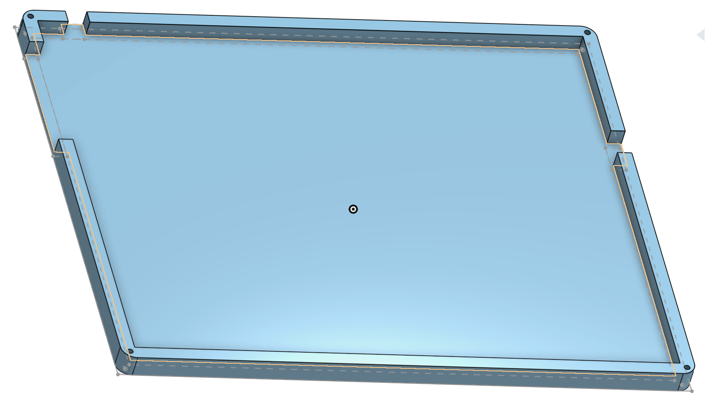

Then of the Top part (with cool Panda logo, also thanks to zsharp's feedback - again, tysm for putting up with me zsharp !)

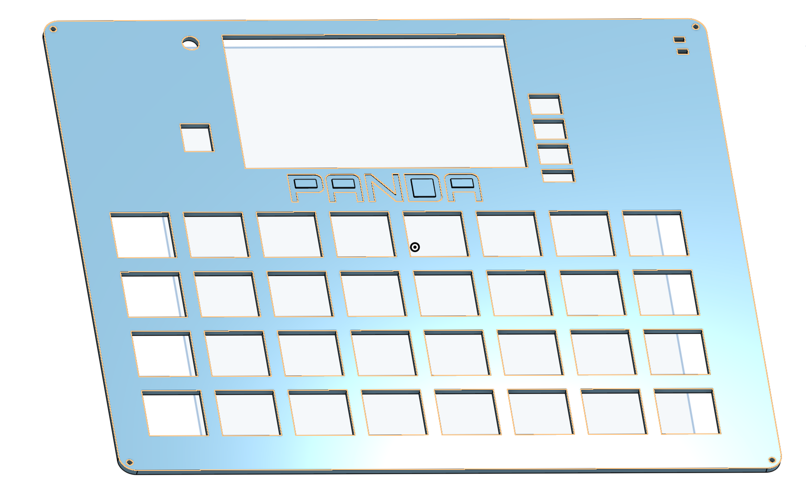

After that for visualization purposes I made an Assembly to show how it will look in the end :

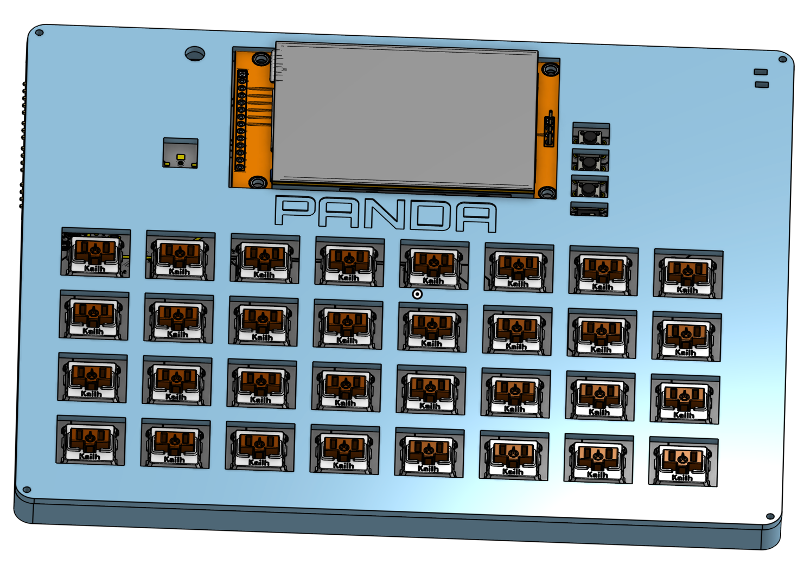

If you want a better more interactive look at this case and how it's built, check out the Onshape document where I made it !

https://cad.onshape.com/documents/acd94843717f517182d6e668/w/23be4fdb216877c251d3e9a3/e/5f36188dd017400931f1858c?renderMode=0&uiState=6a65fce0e255515915538acc

## Firmware

The firmware is a full OS-like environment, not just a bunch of drivers. It runs on the Arduino framework with PlatformIO and gives you a desktop UI, terminal, text editor, file manager, and USB HID keyboard mode.

```
firmware/
├── platformio.ini               # dev + release builds (TFT_eSPI, SdFat)
├── include/
│   ├── config.h                 # all pin definitions
│   ├── kernel.h                 # OS kernel — app management, status bar
│   └── apps.h                   # app function declarations
└── src/
    ├── main.cpp                 # boots hardware + OS, main event loop
    ├── kernel.cpp               # app switching, status bar, event routing
    ├── apps/
    │   ├── desktop.cpp          # home screen — app grid launcher
    │   ├── terminal.cpp         # shell with commands (help, clear, echo, bat, reboot)
    │   ├── editor.cpp           # text editor — cursor, insert/delete, Ln/Col status
    │   ├── files.cpp            # SD card file browser
    │   ├── settings.cpp         # brightness, volume, USB mode toggles
    │   ├── piano.cpp            # keyboard piano — keys 1-8 play notes, octave shift
    │   ├── mic.cpp              # mic level visualizer — real-time bar graph
    │   └── tilt.cpp             # MPU6050 orientation — circle + dot + accel/gyro values
    ├── keyboard/                # 4×8 matrix scanner, debounce, HID keymap
    ├── display/                 # TFT_eSPI wrapper
    ├── audio/                   # I²S output + ES8311 codec + mic input
    ├── touch/                   # XPT2046 SPI touch with calibration
    ├── power/                   # IP5306 battery manager + ADC fallback
    ├── sd_card/                 # SdFat wrapper
    ├── usb_hid/                 # USB HID keyboard — plug in and type
    └── mpu/                     # MPU6050 accelerometer + gyroscope driver
```

#### OS Architecture

The **kernel** manages 8 apps and a persistent status bar. Every keypress is routed to the currently focused app. The loop runs at ~100 Hz:

1. **Keyboard** — matrix scan → debounce → HID keycode lookup
2. **USB HID** — if connected to a computer, sends the same keystrokes
3. **App** — keypress fed to current app's `on_key()` handler
4. **Touch** — polls XPT2046 for touch position
5. **Battery** — reads IP5306 every 10s, shows in status bar
6. **Status bar** — redrawn every 200ms with app name + battery %
7. **Sensors** — MPU6050 and microphone polled by their respective apps

#### Apps

| App      | Icon | What it does                                                     |
| -------- | ---- | ---------------------------------------------------------------- |
| Desktop  | ~    | Grid launcher, arrow keys to navigate, Enter to launch, ESC back |
| Terminal | >    | Shell with `help, clear, echo, bat, apps, reboot`                |
| Editor   | E    | Notepad with cursor movement, insert/delete, modified indicator  |
| Files    | F    | SD card directory listing                                        |
| Settings | S    | Brightness slider (PWM), volume (I²C codec), USB mode toggles    |
| Piano    | P    | 8-key piano (keys 1-8), UP/DN change octave, visual key press    |
| Mic      | M    | Real-time microphone level bar graph, record/pause toggle        |
| Tilt     | T    | 3D orientation circle with dot, live accelerometer/gyro values   |

Pressing **ESC** from any app returns to the Desktop.

#### USB HID

When connected to a computer via USB-C with `-DARDUINO_USB_MODE=1` and `-DARDUINO_USB_CDC_ON_BOOT=1`, the Pandapute shows up as a standard USB keyboard. Everything you type on the mechanical keyboard goes straight to the computer. Modifier keys (Shift, Ctrl, Alt) work too.

#### Building

```bash
cd firmware
pio run -e esp32-s3-dev
pio run -e esp32-s3-dev -t upload
pio device monitor -b 115200
```

Display pins are set in `platformio.ini` via `build_flags`. Touch and SD pins are in `config.h`.

#### Keymap

The keymap in `keyboard/keymap.h` uses standard USB HID keycodes (0x04–0xE7). Modify the `KEYMAP[4][8]` array to match your physical key placement. There are placeholder arrays for `KEYMAP_FN` and `KEYMAP_SYM` layers if you want dual-layer action later.

#### config.h

Single file with every pin, I²C address, and system constant. Change the PCB pinout → edit one file.

### BOM

| #   | Qty | Part                              | Price (€)  | Notes                     |
| --- | --- | --------------------------------- | ---------- | ------------------------- |
| 1   | 1   | ESP32-S3-WROOM-1 N16              | 6.07       | Microcontroller           |
| 2   | 1   | IP5306                            | 1.15       | Charging IC               |
| 3   | 1   | ES8311                            | 3.79       | Audio encoder IC          |
| 4   | 1   | TCA8418RTWR                       | 1.85       | Switch matrix scanning IC |
| 5   | 3   | Tactile switches                  | 9.19       | Power/Boot/etc. switch    |
| 6   | 1   | CMA-4544PF-W                      | 8.29       | Microphone                |
| 7   | 1   | 2000 mAh 3.7V LiPo Battery        | 10.79      | Battery                   |
| 8   | 1   | ILI9341                           | 6.19       | Display                   |
| 9   | 32  | Kailh extreme low profile keycaps | 39.79      | Keycaps                   |
| 10  | 1   | USB-C 2.0 receptacle 16 pin       | 2.09       | USB-C port                |
| 11  | 32  | IN4148                            | 1.05       | Diode                     |
| 12  | 32  | Kailh choc v1 brown switches      | 26.79      | Keyboard switches         |
| 13  | 2   | Blue and green LEDs               | 3.00       | LEDs                      |
| 14  | /   | Resistors from 1 - 100k           | 4.00       | Resistor kit              |
| 15  | 1   | 12 V SPST Switch                  | 2.09       | Switch for battery        |
| 16  | 1   | SKRHABE010                        | 2.59       | 5 way nav switch          |
| 17  | 1   | JST connector kit                 | 3.00       | Connector                 |
| 18  | 1   | PJ-342B                           | 2.69       | 3mm Audio Jack            |
| 19  | 1   | Inductor kit                      | 5.29       | Inductors                 |
| 20  | 1   | MPU6050                           | 4.79       | Tilt sensor               |
| 21  | 1   | 4 Ohm 3 Watt stereo speaker       | 1.79       | Speaker                   |
| 22  | 1   | 32GB SD Card                      | 8.39       | Storage                   |
|     | 1   | **PCB**                           | **140.00** | 191×158mm 4-layer         |
|     | 1   | **Shipping**                      | **40.00**  |                           |
|     |     | **Total**                         | **334.67** |                           |
|     |     | **Total (USD)**                   | **379.89** |                           |

## Why X Tier ?

Although this project was initially supposed to be S-Tier and _much_ more simple than its current version, the idea really
grew on me, and I kept having more and more cool ideas for features I could add, and for some reason I _really_ wanted to outdo the cardputer.
So I put in the effort, watched literal days of videos on differential pairs, PCB design, and looked through countless datasheets just to make this project the best it could possibly be.
It evolved into a complex, extremely cool learning experience and project, not just for me, but for every person at my makespace and on slack who spent hours with me, showing me
what I did wrong (it was a lot), what could be improved (also a lot), and what I did well - A great thanks to all of those people too !

Also, to any reviewers - I hope this project makes the cut for X Tier, and if not, I'll make sure to put in the work to somehow get it there, as it could never survive
on just S Tier.

All in all, I'm extremely happy with what I learned, how much time I put in to this, and how many people contributed to this project.

I couldn't be more proud
